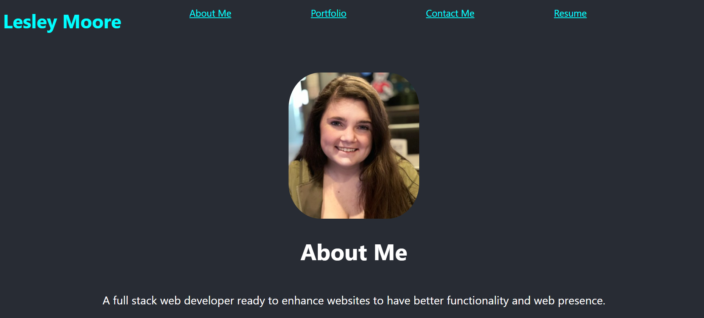

# React_Portfolio

This is a Portfolio built with React. Using react navigation, router, header, footer, and more I have built a fully functional portfolio to show off many projects and give employers more information about me. 

## Requirements

 * Single-page application 
 * Portfolio loads with a page containing header, footer, and section for content
 * Header includes developer's name and navigation titles( About Me, Portfolio, Contact, and Resume)
 * When navigation titles is clicked page is presented without reloading and current title highlighted
 * About me is selected by default the first time the page is loaded
 * About Me section should include picture and short bio of developer
 * Portfolio section should include titled images of 6 of the developers applications with links to deployed site and github
 * Contact section should include a form with name, email, and message fields, it also should include the developers email and phone number since the form does not have a back end 
 * Resume section includes a link to download the developer's resume and a list of developer's profeciences 
 * The footer should have links to the developer's Github, LinkedIn, and Twitter or another platform 

## Preview 

## Deployed Site

[React Portfolio](https://ldmportfolio.herokuapp.com/React_Portfolio)